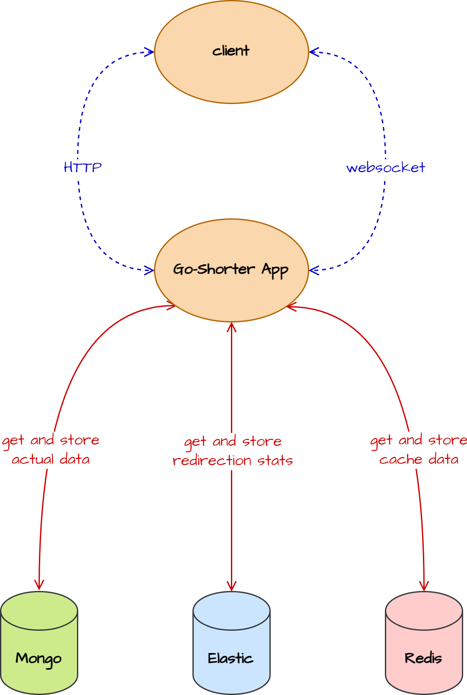

# 🔗 Go Shorter
`This project involves creating a basic URL shortener using Go and Redis. The purpose is to convert lengthy URLs into shorter links, exploring key concepts of web development, API handling, and database management.`

💡 This project `may not be the best way` to create a URL shortener. The `main idea` of this project is to learn and explore the concepts of web development, API handling, and database management using Go.

🎯 The primary goal of this project is to assess and contrast the performance of the API under two conditions: with and without Redis caching.

💬 Feel free to open an issue or a pull request if you have any ideas or suggestions. [Contributions](#contribution) are always welcome.

## Features
- ✅ Store the shortened URLs in MongoDB
- ✅ Redirect to the original URL
- ✅ Get all the shortened URLs information
- ✅ Get a single shortened URL information
- ❌ Delete a single shortened URL
- ❌ Cache the shortened URLs in Redis
- ❌ Add a simple web interface
- ❌ Store the statistics of the shortened URLs
- ❌ Add a simple Dockerfile
- ❌ Create toggle to enable/disable the URL shortener
- ❌ Create toggle to enable/disable caching in Redis

`✅ : Completed | ❌ : Not Completed | ⚒️ : In Progress`

## Technologies and Libraries
- ✅ [`GO`](https://golang.org/) - Main programming language used to build the API
- ✅ [`MongoDB`](https://www.mongodb.com/) - Database to store the shortened URLs
- ✅ [`Redis`](https://redis.io/) - Database to cache the shortened URLs
- ✅ [`Gin`](https://gin-gonic.com/) - HTTP web framework written in Go to build the API
- ✅ [`Mongo-go-driver`](https://www.mongodb.com/docs/drivers/go/current/) - MongoDB driver for Go
- ✅ [`Viper`](https://github.com/spf13/viper) - Go configuration library

`✅ : Completed | ❌ : Not Completed | ⚒️ : In Progress`

## Project Structure
```
.
├── LICENSE
├── README.md
├── controller
│   └── ... (controllers)
├── dev-logs.yml
├── go.mod
├── go.sum
├── main.go
├── model
│   └── ... (models)
├── router
│   └── ... (routers)
└── util
    └── ... (utilities)
```

| Directory | Description |
| --- | --- |
| `controller` | Contains the controllers of the API |
| `model` | Contains the models of the API |
| `router` | Contains the routers of the API |
| `util` | Contains the utilities of the API |

## System Architecture
This is a simple system architecture of the whole project that display the communication between the components. The API is the main component of the system. It communicates with the MongoDB database to store and retrieve the shortened URLs. It also communicates with the Redis database to cache the shortened URLs. The API is also responsible to redirect the user to the original URL when the user requests the shortened URL. The API also communicates with the web interface to display the shortened URLs information.

<div align="center">

</div>

## Contribution
If you have any ideas or suggestions, feel free to open an issue or a pull request.🤝 I would be happy to hear your thoughts.

<div align="center">
    
</div>

## License
📜 This project is licensed under the [MIT License](LICENSE).

## References
- [Go Ecommerce Microservices](https://github.com/mehdihadeli/go-ecommerce-microservices)
- [Building A Cat Fact JSON API With MongoDB And Golang](https://www.youtube.com/watch?v=iak56rgR05A)